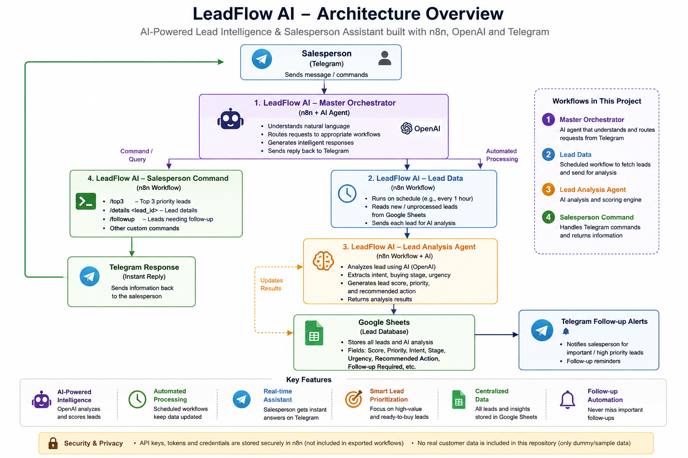
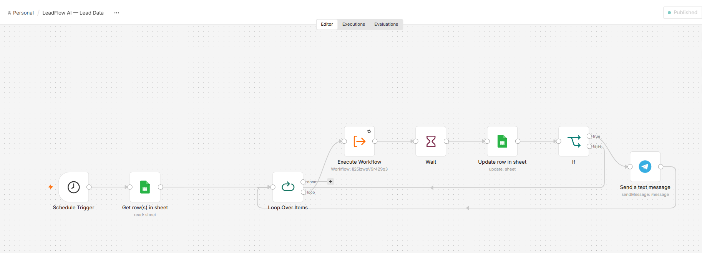
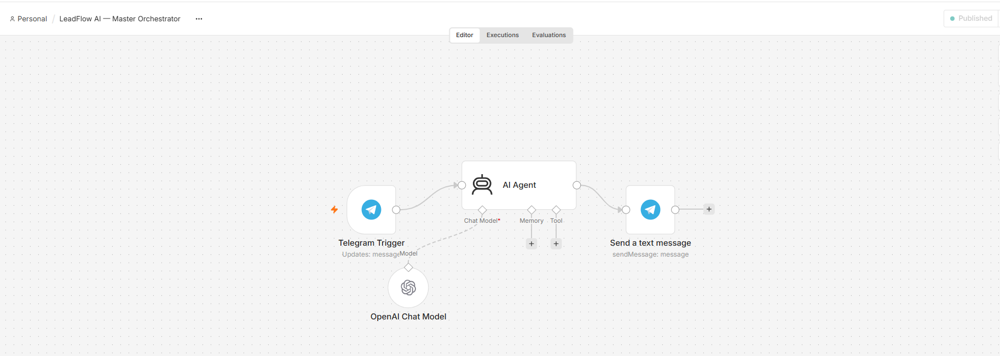
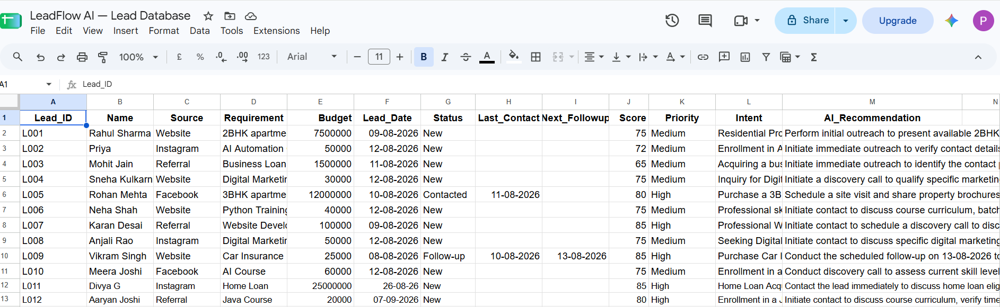
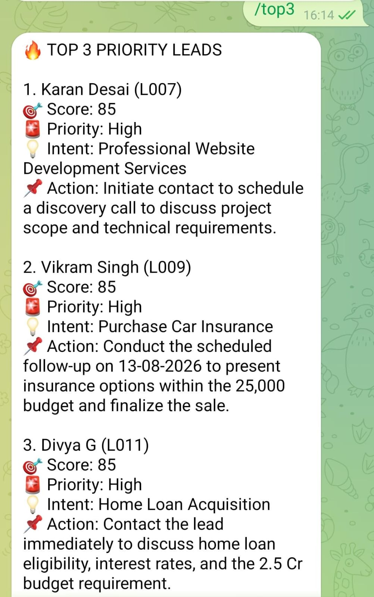
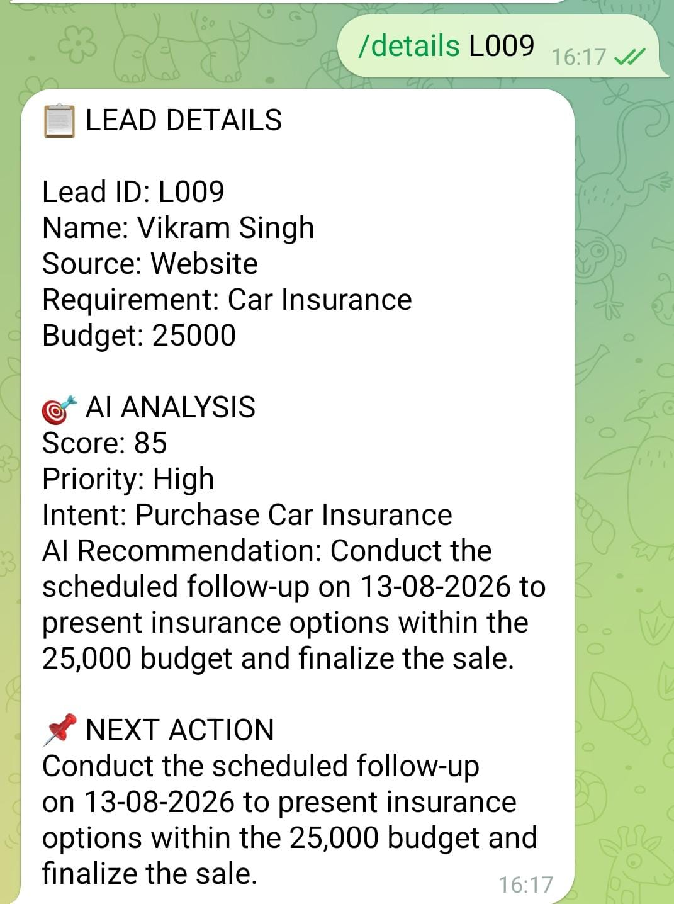

# 🚀 LeadFlow AI

> AI-powered lead intelligence and sales follow-up automation built with n8n, Google Sheets, Telegram, and LLMs.

## 📌 Overview

LeadFlow AI is an AI-powered sales automation system that helps sales teams analyze, prioritize, and follow up with leads.

The system automatically analyzes lead data, generates a lead score, identifies intent and priority, recommends the next action, updates Google Sheets, and sends Telegram alerts for leads requiring follow-up.

Salespeople can also interact with the system through Telegram commands.

## 🎯 Problem Statement

Sales teams often spend significant time manually reviewing leads, deciding which leads should be contacted first, and tracking follow-ups.

LeadFlow AI automates this process by combining workflow automation with AI-powered lead analysis.

## ✨ Key Features

- 🤖 AI-powered lead analysis
- 🎯 Lead scoring and prioritization
- 🔍 Customer intent analysis
- 📊 Buying-stage and urgency analysis
- 💡 AI-generated next-action recommendations
- 📑 Automated Google Sheets updates
- 🔔 Telegram follow-up notifications
- 🥇 Top 3 priority lead identification
- 🔎 Individual lead details lookup
- 🔄 Scheduled lead processing
- 💬 Telegram-based salesperson assistant

## 🏗️ Architecture

## 📸 Project Demonstration

### Lead Data Workflow

### Master Orchestrator

### Google Sheets Results

### Telegram — Top 3 Leads

### Telegram — Lead Details

## 🔄 End-to-End Workflow

                    Lead Data
                        │
                        ▼
              ┌──────────────────┐
              │   Google Sheets  │
              └────────┬─────────┘
                       │
                       ▼
              ┌──────────────────┐
              │  Lead Data       │
              │  n8n Workflow    │
              └────────┬─────────┘
                       │
                       ▼
              ┌──────────────────┐
              │ Lead Analysis    │
              │ AI Agent         │
              └────────┬─────────┘
                       │
                       ▼
             Score / Priority / Intent
                       │
                       ▼
              ┌──────────────────┐
              │ Google Sheets    │
              │ Update           │
              └────────┬─────────┘
                       │
                       ▼
              ┌──────────────────┐
              │ Telegram Alert   │
              └──────────────────┘

## 🛠️ Technology Stack

* n8n - Workflow automation
* LLMs - AI-powered lead analysis
* Google Sheets - Lead data and results
* Telegram Bot - Salesperson interaction and alerts
* JavaScript - Data processing and workflow logic
* JSON - Workflow configuration

## 🔐 Security

- This repository contains only demonstration/sample data.
- No API keys are included.
- No Telegram bot tokens are included.
- No Google credentials are included.
- No real customer information is included.
- Credentials must be configured separately when importing the workflows into n8n.

## 💼 Business Value

* LeadFlow AI can help sales teams:
* Reduce manual lead qualification
* Identify high-value leads faster
* Prioritize salesperson activities
* Reduce missed follow-ups
* Standardize lead analysis
* Improve sales team productivity

## 🚀 Future Enhancements

- CRM integration
- Automatic email follow-ups
- Lead conversion analytics
- Sales dashboard
- Multi-agent lead qualification
- Follow-up scheduling
- Conversation history and memory

## 👩‍💻 Author

Priyanka Ghadi
